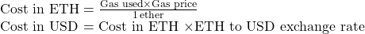

# 🦄 Uniswap Gas Comparison

## Overview

A comprehensive gas report comparing all four versions of Uniswap, a popular decentralized exchange protocol.

To ensure consistency, the gas cost calculations in this report assume a gas price of *40 GWEI*, and the corresponding USD cost calculations assume an exchange rate of *1 ETH = $1750*.

*Formulas used:*

  

&nbsp;
### TODO:

- Deposit Liquidity
- Withdraw Liquidity
- Single-hop Token Swap
- Multi-hop Token Swap

&nbsp;

## Pool Creation

| Version | Method          | Gas        | Cost in ETH (40 gwei) | Cost in USD (1 ETH = $1750) | % Change from previous version|
| ------- | --------------- | ---------- | --------------------- | --------------------------- | ----------------------------- |
| V1      | createExchange  | 251,388    | 0.01005552            | $17.61                      | -                             |
| V2      | createPair      | 2,011,234  | 0.08044936            | $140.79                     | 699.55%                       |
| V3      | createPool      | 4,537,328  | 0.18149312            | $318.37                     | 122.63%                       |
| V4      | initialize      | 35,579     | 0.00142316            | $2.49                       | -99.22%                       |

&nbsp;

## Deposit Liquidity

| Version | Method          | Gas        | Cost in ETH (40 gwei) | Cost in USD (1 ETH = $1750) | % Change from previous version|
| ------- | --------------- | ---------- | --------------------- | --------------------------- | ----------------------------- |
| V1      | addLiquidity    | 84,689     | 0.00338756            | $5.93                       | -                             |
| V2      | mint            | 132,806    | 0.00531224            | $9.30                       | 64.89%                        |
| V3      | -               | -          | -                     | -                           | -                             |
| V4      | -               | -          | -                     | -                           | -                             |

&nbsp;

## Withdraw Liquidity

| Version | Method          | Gas        | Cost in ETH (40 gwei) | Cost in USD (1 ETH = $1750) | % Change from previous version|
| ------- | --------------- | ---------- | --------------------- | --------------------------- | ----------------------------- |
| V1      | -               | -          | -                     | -                           | -                             |
| V2      | -               | -          | -                     | -                           | -                             |
| V3      | -               | -          | -                     | -                           | -                             |
| V4      | -               | -          | -                     | -                           | -                             |

&nbsp;

## Single-hop Token Swap

| Version | Method          | Gas        | Cost in ETH (40 gwei) | Cost in USD (1 ETH = $1750) | % Change from previous version|
| ------- | --------------- | ---------- | --------------------- | --------------------------- | ----------------------------- |
| V1      | -               | -          | -                     | -                           | -                             |
| V2      | -               | -          | -                     | -                           | -                             |
| V3      | -               | -          | -                     | -                           | -                             |
| V4      | -               | -          | -                     | -                           | -                             |

&nbsp;

## Multi-hop Token Swap

| Version | Method          | Gas        | Cost in ETH (40 gwei) | Cost in USD (1 ETH = $1750) | % Change from previous version|
| ------- | --------------- | ---------- | --------------------- | --------------------------- | ----------------------------- |
| V1      | -               | -          | -                     | -                           | -                             |
| V2      | -               | -          | -                     | -                           | -                             |
| V3      | -               | -          | -                     | -                           | -                             |
| V4      | -               | -          | -                     | -                           | -                             |