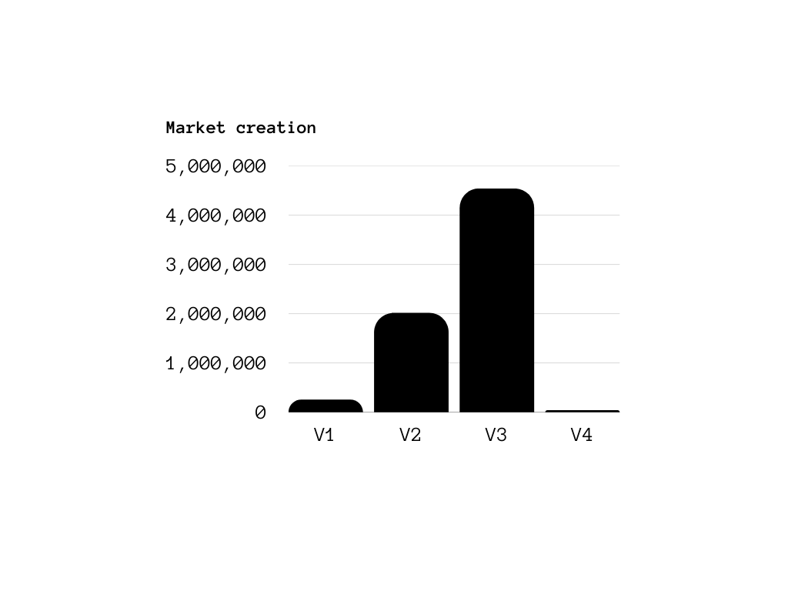

<h1 align="center">🦄 Uniswap Gas Comparison</h1>

## Overview

A comprehensive gas report comparing all four versions of Uniswap, a popular decentralized exchange protocol.

## Market Creation

The table below shows the gas costs for creating markets in different Uniswap versions:

   

<table align="center" style="width: 75%;">
   <tr>
      <th>Version</th>
      <th>Method</th>
      <th>Gas</th>
   </tr>
   <tr>
      <td>V1</td>
      <td>`createExchange()`</td>
      <td>251,388</td>
   </tr>
   <tr>
      <td>V2</td>
      <td>`createPair()`</td>
      <td>2,011,234</td>
   </tr>
   <tr>
      <td>V3</td>
      <td>`createPool()`</td>
      <td>4,537,328</td>
   </tr>
   <tr>
      <td>V4</td>
      <td>`initialize()`</td>
      <td>35,579</td>
   </tr>
</table>